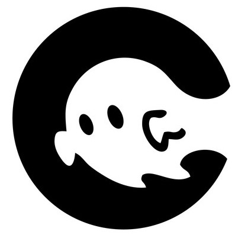

<div id="top"></div>


[![Contributors][contributors-shield]][contributors-url]
[![Forks][forks-shield]][forks-url]
[![Stargazers][stars-shield]][stars-url]
[![Issues][issues-shield]][issues-url]
[![LinkedIn][linkedin-shield]][linkedin-url]


<!-- PROJECT LOGO -->
<br />
<div align="center">
  <a href="https://github.com/kuurdiii/todoapp">
    
  </a>

  <h3 align="center">ToDo App</h3>

  <p align="center">
    A dynamic & aesthetic ToDo web application.
    <br />
    <a href="https://github.com/kuurdiii/todoapp/blob/main/CONTRIBUTION.md"><strong>Explore the docs »</strong></a>
    <br />
    <br />
    <a href="https://kuurdiii.github.io/todoapp/">View Demo</a>
    ·
    <a href="https://github.com/kuurdiii/todoapp/issues">Report Bug</a>
    ·
    <a href="https://github.com/kuurdiii/todoapp/issues">Request Feature</a>
  </p>
</div>


<!-- TABLE OF CONTENTS -->
<details>
  <summary>Table of Contents</summary>
  <ol>
    <li>
      <a href="#about-the-project">About The Project</a>
      <ul>
        <li><a href="#built-with">Built With</a></li>
      </ul>
    </li>
    <li>
      <a href="#getting-started">Getting Started</a>
      <ul>
        <li><a href="#local-setup">Installation</a></li>
      </ul>
    </li>
    <li><a href="#contributing">Contributing</a></li>
    <li><a href="#license">License</a></li>
    <li><a href="#contact">Contact</a></li>
  </ol>
</details>


<!-- ABOUT THE PROJECT -->
## About The Project

[![Product Name Screen Shot][product-screenshot]](https://example.com)
<p align="right">(<a href="#top">back to top</a>)</p>


### Built With

This section should list any major frameworks/libraries used to bootstrap your project. Leave any add-ons/plugins for the acknowledgements section. Here are a few examples.

* [React.js](https://reactjs.org/)
* [Node.js](https://nodejs.org/en/)
* [Webpack.js](https://webpack.js.org)

<p align="right">(<a href="#top">back to top</a>)</p>


<!-- GETTING STARTED -->
## Getting Started

### Local Setup

_Below is an example of how you can instruct your audience on installing and setting up your app. This template doesn't rely on any external dependencies or services._

1. Clone ***your forked repository*** on your local machine.
   ```bash
    git clone https://github.com/<your-github-username>/todoapp.git
    ```
2. Install NPM packages
   ```bash
   npm install
   ```

See the [open issues](https://github.com/kuurdiii/todoapp/issues) for a full list of proposed features (and known issues).

<p align="right">(<a href="#top">back to top</a>)</p>


<!-- CONTRIBUTING -->
## Contributing

Contributions are what make the open source community such an amazing place to learn, inspire, and create. Any contributions you make are **greatly appreciated**.

See the [CONTRIBUTION.md](https://github.com/kuurdiii/todoapp/blob/main/CONTRIBUTION.md) file for contribution information. 

<p align="right">(<a href="#top">back to top</a>)</p>

<!-- LICENSE -->
## License

Distributed under the MIT License. See `LICENSE` for more information.

<p align="right">(<a href="#top">back to top</a>)</p>


<!-- CONTACT -->
## Contact

Moe Kurdi - [Linkedin](https://linkedin.com/in/kurdi1128) - moe@kuurdiii.com

Project Link: [Github](https://github.com/kuurdiii/todoapp)

<p align="right">(<a href="#top">back to top</a>)</p>


[contributors-shield]: https://img.shields.io/github/contributors/kuurdiii/todoapp.svg?style=for-the-badge
[contributors-url]: https://github.com/kuurdiii/todoapp/graphs/contributors
[forks-shield]: https://img.shields.io/github/forks/kuurdiii/todoapp.svg?style=for-the-badge
[forks-url]: https://github.com/kuurdiii/todoapp/network/members
[stars-shield]: https://img.shields.io/github/stars/kuurdiii/todoapp.svg?style=for-the-badge
[stars-url]: https://github.com/kuurdiii/todoapp/stargazers
[issues-shield]: https://img.shields.io/github/issues/kuurdiii/todoapp.svg?style=for-the-badge
[issues-url]: https://github.com/kuurdiii/todoapp/issues
[linkedin-shield]: https://img.shields.io/badge/-LinkedIn-black.svg?style=for-the-badge&logo=linkedin&colorB=555
[linkedin-url]: https://linkedin.com/in/kurdi1128
[product-screenshot]: src/assets/todoapp.png
